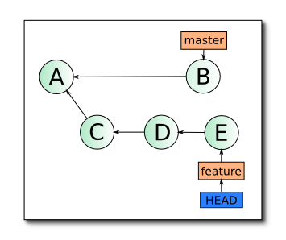
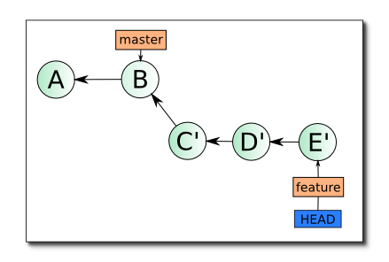

# MergeVSRebase

Слияние - процесс объединения информации из 2-х веток в одну.

В GIT присутствуют 2 типа слияния:
* merge
* rebase

Конечный результат (конечное состояние в ветке репозитория) выполнения обеих операций одинковый, отличе заключается в:
* способе выполнения объединения
* получившейся истории изменений

Рассмотрим разницу на следующем примере:




## Merge
Команда:
```console
$ git checkout master
$ git merge experiment
```

Способ выполнения объединения:
В каждой из веток берется текущей коммит и на базе этих 2-х коммитов создается новый коммит в ветке, в которой выполняется команда слияния

Результирующая история: 
Содержит коммиты с обоих веток

Подробное описание можно найти в статье [Основы слияния](https://git-scm.com/book/ru/v2/%D0%92%D0%B5%D1%82%D0%B2%D0%BB%D0%B5%D0%BD%D0%B8%D0%B5-%D0%B2-Git-%D0%9E%D1%81%D0%BD%D0%BE%D0%B2%D1%8B-%D0%B2%D0%B5%D1%82%D0%B2%D0%BB%D0%B5%D0%BD%D0%B8%D1%8F-%D0%B8-%D1%81%D0%BB%D0%B8%D1%8F%D0%BD%D0%B8%D1%8F#r_basic_merging)

## Rebase
Команда:
```console
$ git checkout experiment
$ git rebase master
$ git checkout master
$ git merge experiment
```

Способ выполнения объединения:
Мы находимся в ветке experiment. Берется последний общий коммит для обеих веток, формируется список коммитов для на основании обеих веток. После этого выполняется последовательное накатывание коммитов с переписыванием истории.

Результирующая история: 
В результирующей истории ветки master после выполнения всех перечисленных выше команд мы будем видеть линейную историю.

Результат:



Подробное описание можно найти в статьях:
* [Ветвление в Git - Перебазирование](https://git-scm.com/book/ru/v2/%D0%92%D0%B5%D1%82%D0%B2%D0%BB%D0%B5%D0%BD%D0%B8%D0%B5-%D0%B2-Git-%D0%9F%D0%B5%D1%80%D0%B5%D0%B1%D0%B0%D0%B7%D0%B8%D1%80%D0%BE%D0%B2%D0%B0%D0%BD%D0%B8%D0%B5#r_rebasing)
* [Git Rebase: руководство по использованию](https://habr.com/ru/articles/161009/)

## Ресурсы
* [Введение в Git Merge и Git Rebase: зачем и когда их использовать](https://habr.com/ru/articles/432420/)